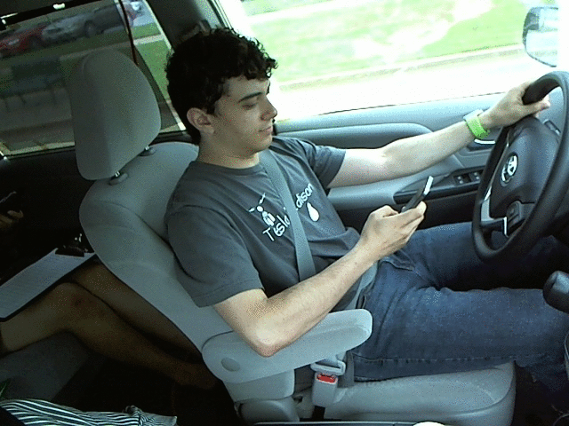

# Driver Distraction Detector

## Demo


## Problem Statement
Driver distraction is a major cause of traffic accidents worldwide. Automatically detecting whether a driver is engaged in safe driving or distracted behaviors (like texting, talking on the phone, or operating the radio) can drastically improve road safety through real-time monitoring and alert systems.

## Dataset
The project analyzes driver distraction images classifying driver states.
- The dataset handles 10 unique classes of behaviors.
- The core of our strategy requires splitting the images at a driver/subject level to test out-of-sample generalization.
*Note: Make sure the dataset is extracted into `data/` before beginning training.*

## Classes
- c0 = Safe Driving
- c1 = Texting - Right
- c2 = Talking on Phone - Right
- c3 = Texting - Left
- c4 = Talking on Phone - Left
- c5 = Operating Radio
- c6 = Drinking
- c7 = Reaching Behind
- c8 = Hair and Makeup
- c9 = Talking to Passenger

## Approach
Dataset
↓
Driver-aware split
↓
Preprocessing
↓
Baseline CNN
↓
Evaluation
↓
MobileNetV2 Transfer Learning
↓
Model Comparison
↓
Streamlit Inference

## Baseline Model
The baseline model is a simple 3-block Convolutional Neural Network (CNN) initialized and trained from scratch. 
Using a lightweight architecture (Conv2D -> ReLU -> MaxPooling) paired with Global Average Pooling allows us to establish a meaningful training baseline before testing heavier models. Specifically, this baseline helps directly identify dataset complexities such as model overfitting on specific driver profiles (generalization gap).

## Improved Model
The improved model utilizes MobileNetV2, acting as a lightweight, scalable transfer learning architecture. It builds upon ImageNet pretrained weights.
- **Stage 1**: The backbone acts purely as an aggressive feature extractor; it is frozen and only the dense classification head is trained.
- **Stage 2**: Later layers of the backbone are unfrozen and trained with a conservatively small learning rate to adapt generic visual structures to the specific driver contexts.


## Error Analysis
*Error Analysis logic generated upon receiving a Confusion Matrix through `src/evaluate.py`.*
Often, similar behaviors physically (e.g. texting left vs speaking to passenger) will cluster confusion, indicating the threshold bounds where the model needs additional focus or stronger visual features to differentiate. 

## Data Leakage Prevention
Validation is rigorously executed using a driver/subject-aware split (`GroupShuffleSplit`) instead of a simple random image split. 
If images were randomly routed, frames of the identical driver (with the identical clothing and vehicle environment) would populate both the train and validation sets. The model would therefore "cheat" by memorizing driver aesthetics (leakage) rather than discovering generalizable behavior patterns. 

## How to Run

1. **Install requirements:**
```bash
pip install -r requirements.txt
```

2. **Train the models:**
```bash
python -m src.train --model baseline
python -m src.train --model improved 
python -m src.train --model improved --fine_tune
```

3. **Evaluate:**
```bash
python -m src.evaluate --model baseline
python -m src.evaluate --model improved
```

4. **Launch Inference UI:**
```bash
streamlit run app/app.py
```

## Project Structure
- `app/`: Contains the Streamlit frontend.
- `assets/`: Visual examples and standard resources.
- `data/`: Extracted images and metadata locations.
- `models/`: High-level output storage for `.keras` inference weights.
- `notebooks/`: Safe harbor for the original analytical implementations.
- `outputs/`: Artifact generation space (Confusion Matrices + Curves).
- `src/`: All logic controllers (Configuration, Data Pipeline, Training, Evaluation).

## Limitations
- **Temporal context**: Classification bounds are set purely off still images as opposed to temporal / video action understanding.
- **Occlusion handling**: Certain visual fields might experience obstruction or irregular lighting (glares), confusing pure 2D features.
- **Confidence unreliability**: Raw probability thresholds resulting from softmax shouldn't be read strictly as true statistical confidence.

## Future Improvements
- real-time webcam/video inference
- temporal modeling
- Grad-CAM
- model quantization
- additional driver diversity
